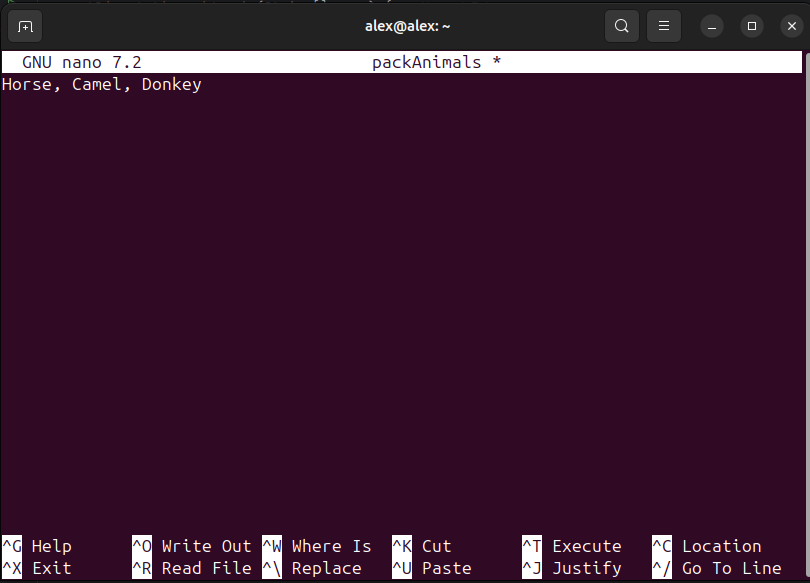
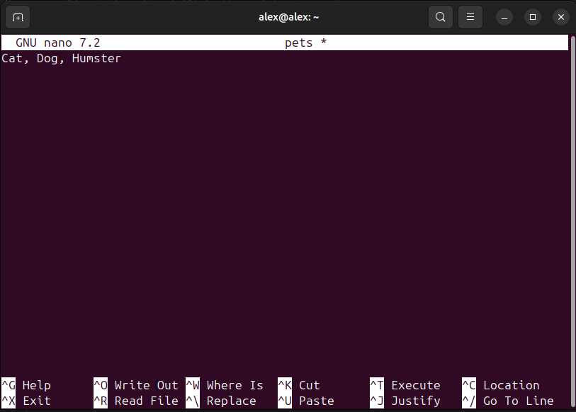

## Информация о проекте
Необходимо организовать систему учета для питомника, в котором живут
домашние и вьючные животные.

## Задание
1. Используя команду cat в терминале операционной системы Linux, создать
   два файла Домашние животные (заполнив файл собаками, кошками,
   хомяками) и Вьючные животными заполнив файл Лошадьми, верблюдами и
   ослы), а затем объединить их. Просмотреть содержимое созданного файла.
   Переименовать файл, дав ему новое имя (Друзья человека).





2. Создать директорию, переместить файл туда.


3. Подключить дополнительный репозиторий MySQL. Установить любой пакет
   из этого репозитория.


4. Установить и удалить deb-пакет с помощью dpkg.


5. Выложить историю в терминале ubuntu

[cammands.txt](commands%2Fcammands.txt)

6. Нарисовать диаграмму, в которой есть класс родительский класс, домашние
   животные и вьючные животные, в составы которых в случае домашних
   животных войдут классы: собаки, кошки, хомяки, а в класс вьючные животные
   войдут: Лошади, верблюды и ослы).

 - [klassDiagramm.drawio](diagramm%2FklassDiagramm.drawio)

7. В подключенном MySQL репозитории создать базу данных “Друзья
   человека”

``` sql
CREATE DATABASE Human_friends;
``` 

8. Создать таблицы с иерархией из диаграммы в БД

``` sql
USE Human_friends;
CREATE TABLE Animals
(

Id INT AUTO_INCREMENT PRIMARY KEY,

AnimalClass VARCHAR(20)
);

INSERT INTO Animals(AnimalClass)
VALUES ('домашние'),
('вьючные');

CREATE TABLE Pets
(
Id INT AUTO_INCREMENT PRIMARY KEY,
Name VARCHAR(20),
IdClass INT,
FOREIGN KEY (IdClass) REFERENCES Animals (Id) ON DELETE CASCADE ON UPDATE CASCADE
);

INSERT INTO Pets(Name, IdClass)
VALUES ('Кошки', 1),
('Собыки', 1),
('Хомяки', 1);

CREATE TABLE PackedAnimals
(
Id INT AUTO_INCREMENT PRIMARY KEY,
Name VARCHAR(20),
IdClass INT,
FOREIGN KEY (IdClass) REFERENCES Animals (Id) ON DELETE CASCADE ON UPDATE CASCADE
);

INSERT INTO PackedAnimals(Name, IdClass)
VALUES ('Лошади', 2),
('Ослы', 2),
('Верблюды', 2);
``` 

9. Заполнить низкоуровневые таблицы именами(животных), командами
   которые они выполняют и датами рождения

``` sql
CREATE TABLE cats
(       
Id INT AUTO_INCREMENT PRIMARY KEY,
Name VARCHAR(20),
Birthday DATE,
Breed VARCHAR(50),
Commands VARCHAR(50),
Pet_id int,
Foreign KEY (Pet_id) REFERENCES Pets (Id) ON DELETE CASCADE ON UPDATE CASCADE
);

INSERT INTO cats (Name, Birthday, Breed, Commands, Pet_id)
VALUES ('Пушистик', '2017-03-15', 'Чешыр', 'кирикири', 1),
('Луна', '2018-04-16', 'Дворовая', 'кыс-кыс', 1),
('Вася', '2016-09-21', 'Египитский', 'Брысь!', 1);

CREATE TABLE dogs
(       
Id INT AUTO_INCREMENT PRIMARY KEY,
Name VARCHAR(20),
Birthday DATE,
Breed VARCHAR(50),
Commands VARCHAR(50),
Pet_id int,
Foreign KEY (Pet_id) REFERENCES Pets (Id) ON DELETE CASCADE ON UPDATE CASCADE
);

INSERT INTO dogs (Name, Birthday, Breed, Commands, Pet_id)
VALUES ('Шарик', '2015-07-04', 'Дворняга', 'Ко мне', 2),
('Джек', '2014-09-11', 'Спаниель', 'Фас', 2),
('Воланд', '2022-02-17', 'Волкодав', 'Взять', 2);

CREATE TABLE humster
(       
Id INT AUTO_INCREMENT PRIMARY KEY,
Name VARCHAR(20),
Birthday DATE,
Breed VARCHAR(50),
Commands VARCHAR(50),
Pet_id int,
Foreign KEY (Pet_id) REFERENCES Pets (Id) ON DELETE CASCADE ON UPDATE CASCADE
);

INSERT INTO humster (Name, Birthday, Breed, Commands, Pet_id)
VALUES ('Волчок', '2020-04-02', 'Коричневый хомяк', 'Пи пи', 3),
('Лилу', '2022-09-11', 'Белый хомяк', 'Чик чик', 3),
('Гаврил', '2021-11-30', 'Серый хомяк', 'Ко мне', 3);

CREATE TABLE horses
(       
Id INT AUTO_INCREMENT PRIMARY KEY,
Name VARCHAR(20),
Birthday DATE,
Commands VARCHAR(50),
PackedAnimals_Id int,
Foreign KEY (PackedAnimals_Id) REFERENCES PackedAnimals (Id) ON DELETE CASCADE ON UPDATE CASCADE
);

INSERT INTO horses (Name, Birthday, Commands, PackedAnimals_Id)
VALUES ('Крепыш', '2015-11-09', 'вперед', 1),
('Блэки', '2018-07-04', "але гоп", 1),  
('Белоснежка', '2019-01-23', "галоп", 1);

CREATE TABLE donkeys
(       
Id INT AUTO_INCREMENT PRIMARY KEY,
Name VARCHAR(20),
Birthday DATE,
Commands VARCHAR(50),
PackedAnimals_Id int,
Foreign KEY (PackedAnimals_Id) REFERENCES PackedAnimals (Id) ON DELETE CASCADE ON UPDATE CASCADE
);

INSERT INTO donkeys (Name, Birthday, Commands, PackedAnimals_Id)
VALUES ('ИА', '2021-03-12', 'Неси', 2),
('Балван', '2022-03-14', "не ори", 2),  
('Упрямец', '2020-06-20', "иди", 2);

CREATE TABLE camels
(       
Id INT AUTO_INCREMENT PRIMARY KEY,
Name VARCHAR(20),
Birthday DATE,
Commands VARCHAR(50),
PackedAnimals_Id int,
Foreign KEY (PackedAnimals_Id) REFERENCES PackedAnimals (Id) ON DELETE CASCADE ON UPDATE CASCADE
);

INSERT INTO camels (Name, Birthday, Commands, PackedAnimals_Id)
VALUES ('Серый', '2020-09-23', 'Не плюй', 3),
('Важный', '2017-10-25', "Вставай", 3),  
('Упрямец', '2020-06-20', "иди", 3);
``` 

10. Удалив из таблицы верблюдов, т.к. верблюдов решили перевезти в другой
    питомник на зимовку. Объединить таблицы лошади, и ослы в одну таблицу.

``` sql
TRUNCATE TABLE camels;
SELECT * FROM camels;

SELECT Name, Birthday, Commands FROM horses
UNION SELECT Name, Birthday, Commands FROM donkeys;
```

11. Создать новую таблицу “молодые животные” в которую попадут все
    животные старше 1 года, но младше 3 лет и в отдельном столбце с точностью
    до месяца подсчитать возраст животных в новой таблице

``` sql
CREATE TEMPORARY TABLE animals AS
SELECT Name, Birthday, Commands, 'Лошади' as genus FROM horses
UNION SELECT Name, Birthday, Commands, 'Ослы' AS genus FROM donkeys
UNION SELECT Name, Birthday, Commands, 'Верблюды' AS genus FROM camels
UNION SELECT Name, Birthday, Commands, 'Собаки' AS genus FROM dogs
UNION SELECT Name, Birthday, Commands, 'Кошки' AS genus FROM cats
UNION SELECT Name, Birthday, Commands, 'Хомяки' AS genus FROM humster;

select * from animals;

CREATE TABLE yangAnimal AS
SELECT Name, Birthday, Commands, genus, TIMESTAMPDIFF(MONTH, Birthday, CURDATE()) AS Age_in_month
FROM animals WHERE Birthday BETWEEN ADDDATE(curdate(), INTERVAL -3 YEAR) AND ADDDATE(CURDATE(), INTERVAL -1 YEAR);
 
SELECT * FROM yangAnimal;
```
12. Объединить все таблицы в одну, при этом сохраняя поля, указывающие на
    прошлую принадлежность к старым таблицам.

``` sql
SELECT h.Name, h.Birthday, h.Commands, pa.Name, ya.Age_in_month
FROM horses h
LEFT JOIN PackedAnimals pa ON pa.Id = h.PackedAnimals_Id
LEFT JOIN yangAnimal ya ON ya.Name = h.Name
UNION
SELECT d.Name, d.Birthday, d.Commands, ya.genus, ya.Age_in_month
FROM donkeys d
LEFT JOIN yangAnimal ya ON ya.Name = d.Name
LEFT JOIN PackedAnimals pa ON pa.Id = d.PackedAnimals_Id
UNION
SELECT c.Name, c.Birthday, c.Commands, ya.genus, ya.Age_in_month
FROM camels c
LEFT JOIN yangAnimal ya ON ya.Name = c.Name
LEFT JOIN PackedAnimals pa ON pa.Id = c.PackedAnimals_Id
UNION
SELECT cat.Name, cat.Birthday, cat.Commands, ya.genus, ya.Age_in_month
FROM cats cat
LEFT JOIN yangAnimal ya ON ya.Name = cat.Name
LEFT JOIN Pets pet ON pet.Id = cat.Pet_id
UNION
SELECT dog.Name, dog.Birthday, dog.Commands, ya.genus, ya.Age_in_month
FROM dogs dog
LEFT JOIN yangAnimal ya ON ya.Name = dog.Name
LEFT JOIN Pets pet ON pet.Id = dog.Pet_id
UNION
SELECT hum.Name, hum.Birthday, hum.Commands, ya.genus, ya.Age_in_month
FROM humster hum
LEFT JOIN yangAnimal ya ON ya.Name = hum.Name
LEFT JOIN Pets pet ON pet.Id = hum.Pet_id;
```

13. Создать [класс с Инкапсуляцией методов и наследованием по диаграмме](src%2Fclasses).
14. Написать [программу](src), имитирующую работу реестра домашних животных.
    В программе должен быть реализован следующий функционал:    
    14.1 Завести новое животное    
    14.2 определять животное в правильный класс    
    14.3 увидеть список команд, которое выполняет животное    
    14.4 обучить животное новым командам    
    14.5 Реализовать навигацию по меню
15. Создайте [класс Счетчик](src%2Fclasses%2FCounter.java), у которого есть метод add(), увеличивающий̆
    значение внутренней̆ int переменной̆ на 1 при нажатии “Завести новое
    животное” Сделайте так, чтобы с объектом такого типа можно было работать в
    блоке try-with-resources. Нужно бросить исключение, если работа с объектом
    типа счетчик была не в ресурсном try и/или ресурс остался открыт. Значение
    считать в ресурсе try, если при заведении животного заполнены все поля.